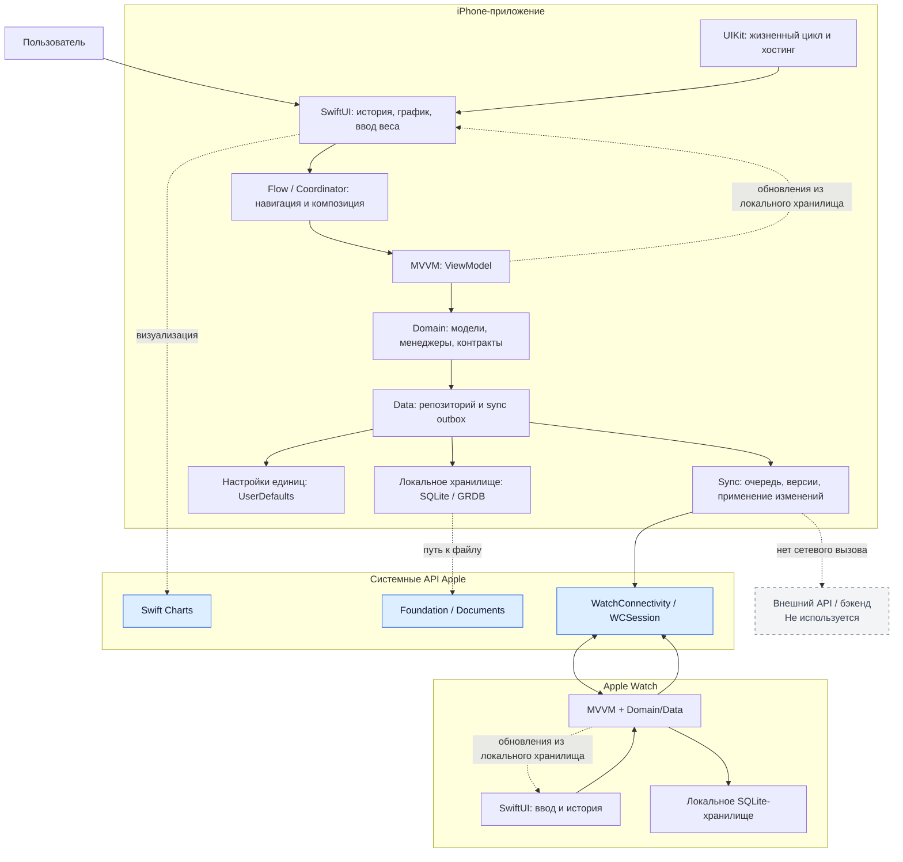

# WeightMonitor

## Описание

WeightMonitor — приложение для iPhone и Apple Watch, которое помогает фиксировать вес, просматривать историю и динамику изменений, а также поддерживать данные на устройствах в актуальном состоянии. Интерфейс построен на **SwiftUI**; **UIKit** отвечает за жизненный цикл iOS-приложения и встраивание SwiftUI-экрана.

## Основные возможности

- Добавление, редактирование и удаление записей веса.
- История измерений с постраничной загрузкой и состояниями загрузки, пустого списка и ошибки.
- График динамики веса и переключение между метрической и имперской системами единиц.
- Локальное хранение данных на каждом устройстве.
- Двусторонняя синхронизация записей между iPhone и Apple Watch.

## Архитектура системы

Проект следует принципам **модульной Clean Architecture**: зависимости направлены к доменному слою, а конкретные реализации изолированы на границе данных. Для представления используется **MVVM**, а навигация и сборка экранов управляются отдельным Flow/Coordinator-слоем.

| Слой / модуль | Назначение |
| --- | --- |
| **App** | Composition root: собирает зависимости, запускает синхронизацию и связывает пользовательские сценарии. |
| **Features** | SwiftUI-экраны истории и ввода веса, их ViewModel и переиспользуемые UI-компоненты. |
| **Domain** | Независимые бизнес-модели, контракты репозиториев и менеджеры операций с весом и единицами измерения. |
| **Data** | Реализует контракты Domain, хранит записи и параметры пользователя локально, готовит изменения к синхронизации. |
| **Sync** | Передаёт изменения между устройствами, применяет входящие данные и контролирует состояние исходящей очереди. |
| **WatchApp** | Самостоятельный watchOS-клиент с теми же Domain/Data/Sync-модулями. |

## Потоки данных и API



## Как данные проходят по системе

Пользовательский ввод поступает из SwiftUI во ViewModel, затем в доменный слой и репозиторий. Репозиторий сохраняет данные в локальную SQLite-базу; наблюдение за ней обновляет интерфейс на iPhone и Apple Watch. Изменения попадают в очередь синхронизации и передаются через системный `WatchConnectivity` API, после чего принимающее устройство применяет их в своей локальной базе и подтверждает доставку.

## Инструменты проекта

| Инструмент | Роль в проекте |
| --- | --- |
| **Tuist** | Декларативно описывает модули, их зависимости и генерирует Xcode workspace; включён контроль явных зависимостей между модулями. |
| **Mise** | Фиксирует версии инструментов и предоставляет единые команды для установки зависимостей, генерации workspace, проверки и тестов. |
| **Fastlane** | Запускает стандартизированные проверки качества и тестирования в локальном окружении и CI. |

## Первый запуск

```bash
brew install mise
mise install
mise run generate
open WeightMonitor.xcworkspace
```

Для полной проверки проекта используйте `mise run check`. Mise также предоставляет сокращённые команды: `mise run install` для зависимостей Tuist, `mise run test` для тестов и `mise run clean` для очистки сгенерированных артефактов.
